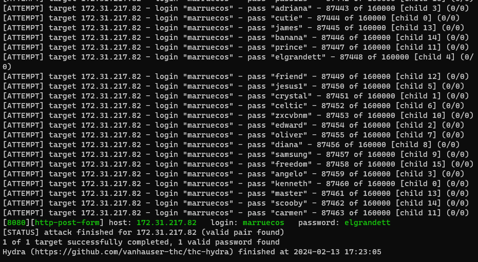

# **Titre : Brute Force Attack**

# **Catégorie : Sécurité Web**

## **Équipe : Akatsuki Security**

## **Personnes : EL HAMIOUI Yassine**

## **Description - Énoncé :**

Dans ce défi, vous êtes confronté à une page de connexion où vous devez saisir un nom d'utilisateur et un mot de passe. L'objectif est d'utiliser une attaque de force brute pour trouver les identifiants de connexion corrects et ainsi obtenir le flag.

La page de connexion est écrite en PHP et vérifie les identifiants saisis par l'utilisateur. Si les identifiants sont corrects, le serveur renvoie un message indiquant que la connexion a réussi et affiche le flag. Sinon, le serveur affiche un message indiquant que les identifiants de connexion sont incorrects.

# **Solution :**

1. Utilisation de la wordlist : Utilisez la wordlist fournie dans le fichier yaskouser.txt pour générer des combinaisons de noms d'utilisateur et de mots de passe à tester.
2. Attaque de force brute : Utilisez un outil tel que Hydra pour exécuter une attaque de force brute en essayant toutes les combinaisons possibles de noms d'utilisateur et de mots de passe à partir de la wordlist.
3. Identification des identifiants corrects : Une fois que vous avez trouvé les identifiants de connexion corrects, notez-les pour accéder à la page de connexion et obtenir le flag.
4. **Wordlist et attaque de force brute :**

   Utilisez le fichier yaskouser.txt pour les noms d'utilisateur et le fichier yaskopass.txt pour les mots de passe possibles. Configurez Hydra pour exécuter une attaque de force brute en utilisant ces wordlists.

   Exemple de commande Hydra :  
     
   hydra -L yaskouser.txt -P yaskopass.txt @machine -s mettreleport http-post-form "/chemindossier/index.php:username=^USER^&password=^PASS^:H=" -F -V  
     
   Il est important de mettre -F pour que l'attaque s'arret lorsque les logins sont trouvé puis eviter des faux positif.

   

## **Flag:** BRUTEFORCE_Akatsuki_CTF_SUCCESS

# **Docker :**

- [x] Oui :
  - Explication du fonctionnement du Docker : Le fichier Dockerfile fourni crée un environnement isolé contenant l'application web vulnérable. Il utilise l'image PHP 7.4 avec Apache comme serveur web. Le contenu de l'application est copié dans le répertoire `/var/www/html` du conteneur. Le conteneur expose le port 80 pour permettre l'accès au serveur web. Enfin, la commande `apache2-foreground` est exécutée pour démarrer le serveur Apache dans le conteneur.
- [ ] Non