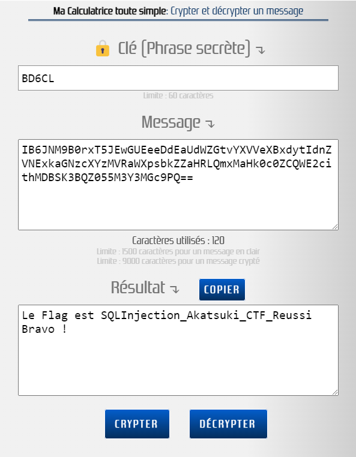

# **Titre : Injection SQL**

# **Catégorie : Sécurité Web**

## **Équipe : Akatsuki Security**

## **Personnes : EL HAMIOUI Yassine**

## **Description - Énoncé :**

Le défi d'injection SQL consiste à exploiter une vulnérabilité dans une application web pour obtenir des informations sensibles à partir d'une base de données. Vous serez confronté à une page de connexion qui vérifie les identifiants saisis par l'utilisateur. L'objectif est d'utiliser une injection SQL pour contourner l'authentification et obtenir le flag.

# **Solution :**

1. **Identifier les champs vulnérables :** Pour commencer, examinez les champs de saisie de la page de connexion (nom d'utilisateur, mot de passe) pour déterminer s'ils sont vulnérables à une injection SQL.
2. **Utiliser des injections SQL :** Utilisez des techniques d'injection SQL pour contourner l'authentification et accéder à la base de données. Par exemple, essayez d'injecter des commandes SQL dans le champ de saisie du nom d'utilisateur ou du mot de passe pour manipuler la requête SQL et récupérer les informations souhaitées.
3. **Lecture du code source :** Une fois l'injection réussie, examinez le code source de la page pour repérer un formulaire. Ce formulaire permet de faire une recherche à partir de la localisation du trésor. Si la localisation est "Secret Island", le code affichera un faux flag.
4. **Déchiffrement :** Puis arrivé sur la page de résultats de recherche à partir de la localisation, recherchez dans le code source pour trouver des indications sur la poursuite du défi. Il faut déchiffrer le code chiffré en utilisant une clé. La clé est indiquée sous forme de message après chaque point, où chaque initiale de mot forme la clé "BD6CL". Une fois la clé obtenue, utilisez-la sur un site de déchiffrement fourni pour révéler le faux flag.

   

# **Flag:** SQLInjection_Akatsuki_CTF_Reussi

# **Docker :**

- [x] Oui :
  - Le Dockerfile fourni crée un conteneur Docker isolé pour héberger l'application web vulnérable. Cette application utilise un serveur Apache et PHP pour gérer les requêtes HTTP. Le fichier Dockerfile installe les dépendances nécessaires, copie les fichiers de l'application dans le conteneur Docker et démarre le serveur Apache.

    Le fichier docker-compose.yml décrit les services et les configurations pour orchestrer les conteneurs Docker. Il définit deux services :
    1. "web" : Ce service construit l'image Docker en utilisant le Dockerfile fourni. Il expose le port 8080 du conteneur Docker sur le port 80 de l'hôte local et monte les fichiers de l'application depuis le répertoire local vers le répertoire /var/www/html du conteneur Docker.
    2. "db" : Ce service utilise l'image Docker MySQL version 8.2. Il définit une base de données MySQL nommée "ctf1" avec un mot de passe root "root" et monte un script SQL pour initialiser la base de données lors du démarrage du conteneur MySQL.
- [ ] Non